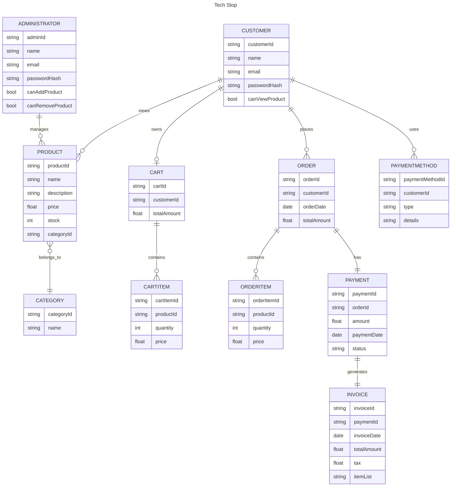

# Tech Stop - Online Electronics Store

**Tech Stop** is a complete online store that allows users to shop for their favorite electronics while providing an intuitive admin panel for managing the store's inventory and business operations. This project is divided into two main sections: the **Admin Panel** and the **Customer/User Site**.

## Table of Contents

- [Project Description](#project-description)
- [Features](#features)
  - [Admin Panel](#admin-panel)
  - [Customer/User Site](#customeruser-site)
- [Technologies Used](#technologies-used)
- [Installation](#installation)
- [Usage](#usage)
  - [Admin Access](#admin-access)
  - [Customer Access](#customer-access)
- [Contributors](#contributors)

## Project Description

Tech Stop is designed to provide a seamless shopping experience for customers while allowing administrators to manage the store efficiently. The project is built with two distinct panels:

- **Admin Panel**: A secure, protected area where administrators can add, delete, and modify products in the inventory.
- **Customer/User Site**: A user-friendly interface where customers can browse products, add items to their cart, and proceed to checkout.

## Object Model (Mermaid code)



### Admin Panel

The Admin Panel is exclusively for store administrators and includes the following features:

- **Add Products**: Admins can add new electronic products to the inventory.
- **Delete Products**: Admins can remove outdated or unavailable products.
- **Modify Products**: Admins can update product details such as price, description, and stock quantity.
- **Inventory Management**: Admins can monitor stock levels and manage product categories.

This panel is protected by authentication to ensure that only authorized users (admins) can access it.

### Customer/User Site

The Customer/User section is designed to provide a smooth shopping experience with the following features:

- **Product Browsing**: Customers can view all available electronics, organized by categories.
- **Search Functionality**: Users can search for specific products by name or category.
- **Product Details Page**: Each product has a dedicated page with detailed information (price, description, specifications).
- **Shopping Cart**: Users can add products to their cart and view them before proceeding to checkout.
- **Checkout Process**: Customers can finalize their purchases by entering payment and shipping information.

## Technologies Used

The project is built using the following technologies:

- **Frontend**: HTML5, CSS3, JavaScript (React.js)
- **Backend**: Node.js
- **Database**: MongoDB
- **Version Control**: Git & GitHub

## Installation

To run this project locally, follow these steps:

1. Clone the repository:
   ```bash
   git clone https://github.com/yourusername/tech-stop.git
   ```
2. Navigate into the project directory:
   ```bash
   cd tech-stop
   ```
3. Install dependencies:
   ```bash
   npm install    # If using Node.js/Express.js
   ```
4. Set up environment variables:
   - Create a `.env` file in the root directory and add necessary variables (e.g., database connection strings, JWT_SECRET).
5. Start the development server:
   ```bash
   npm start      # For Node.js/Express.js backend
   ```

## Contributors

This project was developed by:

- Tejas venkatesh.te@northeastern.edu
- Dhyey rabadiya.d@northeastern.edu
- Manav kheni.m@northeastern.edu
- Joevita felixanthonyraj.j@northeastern.edu

## Video Demonstration

The video demonstration can be viewed [here](https://northeastern-my.sharepoint.com/:v:/r/personal/venkatesh_te_northeastern_edu/Documents/Recordings/Meeting%20in%20Tech%20Stop-20241207_160651-Meeting%20Recording.mp4?csf=1&web=1&e=d7x4DL&nav=eyJyZWZlcnJhbEluZm8iOnsicmVmZXJyYWxBcHAiOiJTdHJlYW1XZWJBcHAiLCJyZWZlcnJhbFZpZXciOiJTaGFyZURpYWxvZy1MaW5rIiwicmVmZXJyYWxBcHBQbGF0Zm9ybSI6IldlYiIsInJlZmVycmFsTW9kZSI6InZpZXcifX0%3D).
